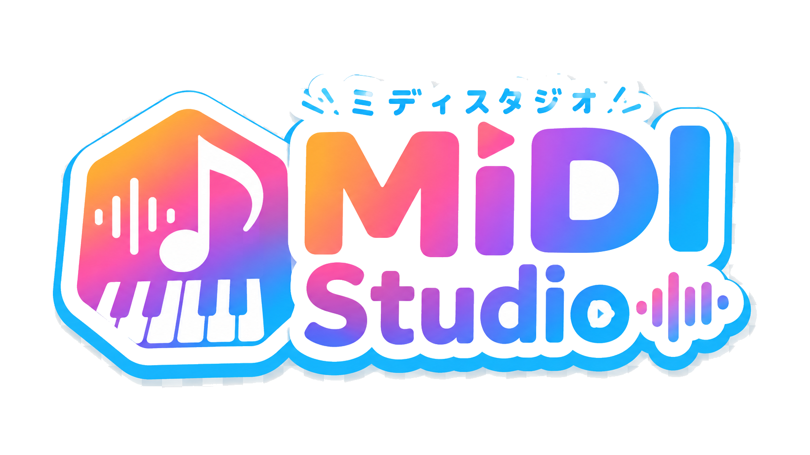
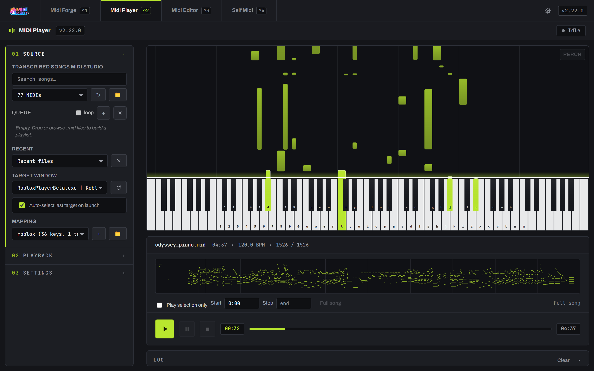
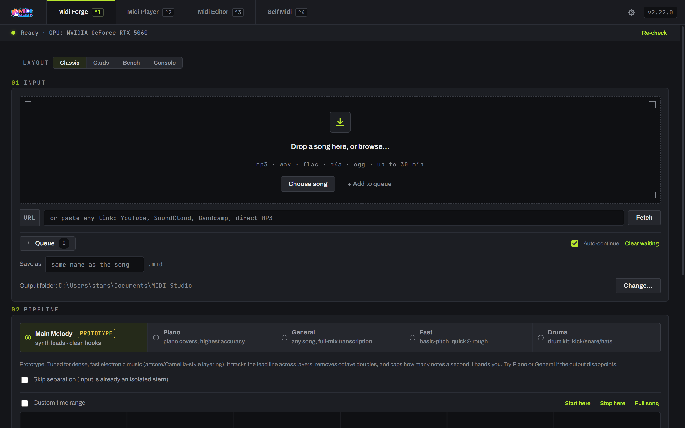
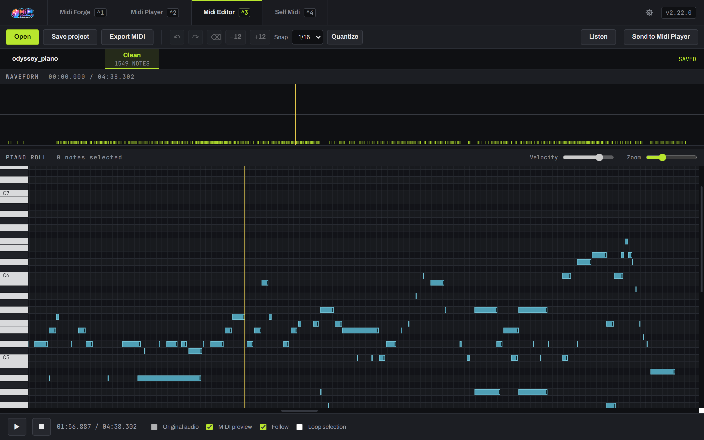
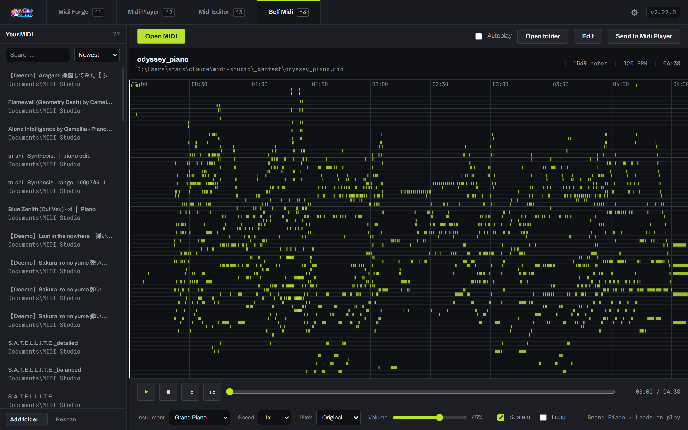

<div align="center">



**Turn a song into MIDI, edit it, and play it back on any keyboard.**

[](https://github.com/StarsationX/midi-studio/releases/latest)
[](https://github.com/StarsationX/midi-studio/releases)
[](./LICENSE)
[](https://github.com/StarsationX/midi-studio/releases/latest)



</div>

---

## What it does

Four tabs, one window. Drop a song in the first, and it comes out the other end as something
you can actually play.

|  | | |
|---|---|---|
| **Midi Forge** | Song → MIDI | Feed it an audio file or a YouTube/SoundCloud link. AI source separation splits the mix, then transcription turns the part you care about into notes: piano, full mix, a synth lead, or a full drum kit — kick, snare, closed and open hat, three toms, crash and ride. |
| **Midi Player** | MIDI → keystrokes | Plays a MIDI into any other Windows app by simulating keypresses, for Roblox piano games, [virtualpiano.net](https://virtualpiano.net), or anything else that listens to a keyboard. Live piano roll, global hotkeys, tempo and transpose, and it pauses itself when the target window loses focus. |
| **Midi Editor** | Fix the transcription | Piano-roll editing against the original waveform. Drag, box-select, quantize, transpose, undo/redo, export. |
| **Self Midi** | Just listen | Plays a MIDI inside the app with bundled General MIDI instruments, no game or target window needed. |

<table>
<tr>
<td width="50%"><br><sub><b>Midi Forge</b> — pick a pipeline, drop a song</sub></td>
<td width="50%"><br><sub><b>Midi Editor</b> — notes against the original audio</sub></td>
</tr>
<tr>
<td width="50%"><br><sub><b>Self Midi</b> — your library, played in-app</sub></td>
<td width="50%"><br><sub><b>Midi Player</b> — live roll, mapped to a real keyboard</sub></td>
</tr>
</table>

## Download

**[⬇ Get the latest installer](https://github.com/StarsationX/midi-studio/releases/latest)** —
grab `MIDI-Studio-<version>-Setup.exe` and run it. Windows x64.

**No separate Python install is required.** The Player, Editor, and Self Midi tabs work the moment
setup finishes.

Midi Forge is the exception, because it needs PyTorch and a few gigabytes of models. Setup asks
where to keep them and remembers that location across upgrades. The first time you open Forge,
click **Set up Midi Forge** and it downloads everything itself — about 4 GB down, ~15 GB free space
on that drive, NVIDIA GPU recommended. One time only, and the folder is changeable later in
Settings.

> [!NOTE]
> Windows SmartScreen will say "unknown publisher" — the build isn't code-signed yet.
> Choose **More info → Run anyway**.

## Updates

The app checks [Releases](https://github.com/StarsationX/midi-studio/releases) a few seconds after
launch, or on demand from the version badge. It verifies the download's SHA-256 against the digest
GitHub publishes for the release asset, then applies it through the full installer. Toggle it off in
**⚙ Settings** if you'd rather update by hand.

## Build from source

```powershell
git clone https://github.com/StarsationX/midi-studio.git
cd midi-studio
npm install

npm start            # dev run (needs Python 3.10+ with the player deps on PATH)
npm test             # unit tests
npm run build:nsis   # -> dist/MIDI-Studio-<version>-Setup.exe
```

`build:nsis` first builds a small bundled Python into `python-engine/python/` with the player
dependencies, so the installer ships self-contained.

## How it's put together

```
electron/        main process, Python sidecar manager, forge runner/provisioner, updater
renderer/        shell + the Forge, Player, Editor, and Self Midi tabs
python-engine/   midi_player.py + ipc_main.py       (playback engine)
                 song_to_midi / transcribe / ...    (forge pipeline)
                 provision_forge.py                 (the dependency downloader)
.github/         CI: build on Windows, publish on a v* tag
```

Electron front end, Python doing the audio work, talking over stdin/stdout JSON.

## License

MIT — see [LICENSE](./LICENSE).
